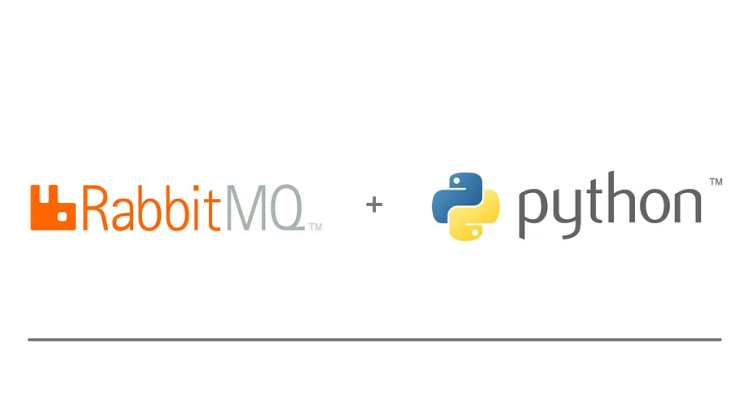

# RabbitMQ with Python

Publish and consume messages from RabbitMQ with Python

## Introduction
A **Message Broker** is an intermediary software component that facilites communication and data exchange between different applications or systems. It plaus a crucial role in supporting a distributed architecture by enabling seamless communication between various components, even if they running on different plaforms, using differente programming languages, or have another technologies.

**RabbitMQ** is a Message Broker written in Erlang, that support AMQP protocols and others, designed for works a distributed, fault-tolerant, soft real-time system with almost 99.999% uptime. 

To know more about RabbitMQ, access: [RabbitMQ Documentation](https://www.rabbitmq.com/docs/documentation)

## Setup environment
### Prerequisite
1. In this use case we will use RabbitMQ installed in the Docker. Please, consider the following repository for setup.

Repository: [rabbitmq-cluster-doker](https://github.com/edeilson-david/rabbitmq-cluster-docker)

2. Make sure you have [Poetry](https://python-poetry.org/) installed.

### Project
Open the Command Line Interface (CLI). For example, the Terminal on Ubuntu.
1. Navigate to this project root folder.
2. Execute the folloing command:
```shell
poetry install
```

## Quick Start
Inside the `src/application` there are examples about each exchange. Sample:

1. Initialize the RabbitMQ cluster in the repository specified previously.
2. Open the Command Line Interface (CLI). For example, the Terminal on Ubuntu.
3. Navigate to this project root folder.
4. Launch consumers:

```shell
python src/application/direct/consumer_appchat.py
python src/application/direct/consumer_sms.py
```

When the consumer is launched the terminal is attached and blocked to type anything. Type Ctrl+C to stop consumer and release terminal.

5. Launch publisher:
```shell
python src/application/direct/publisher.py
```
